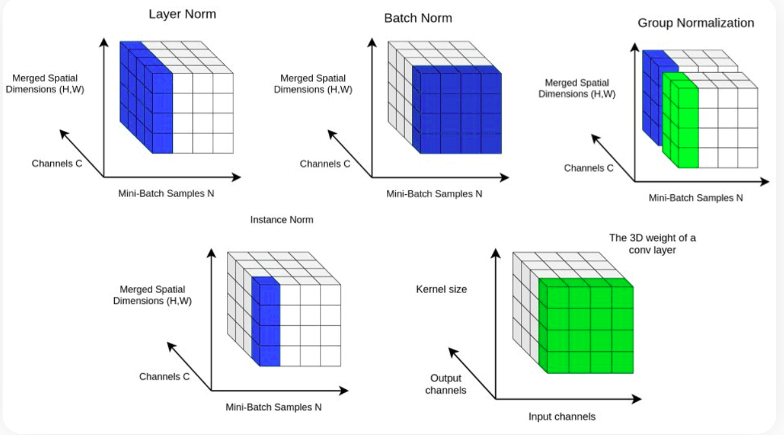
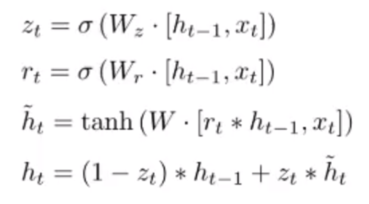
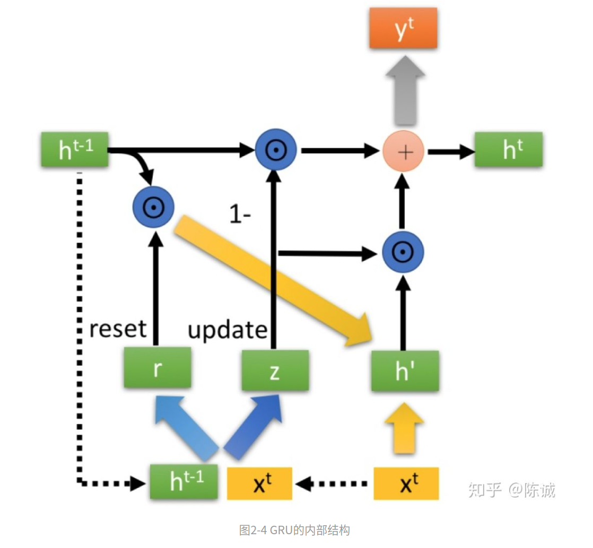
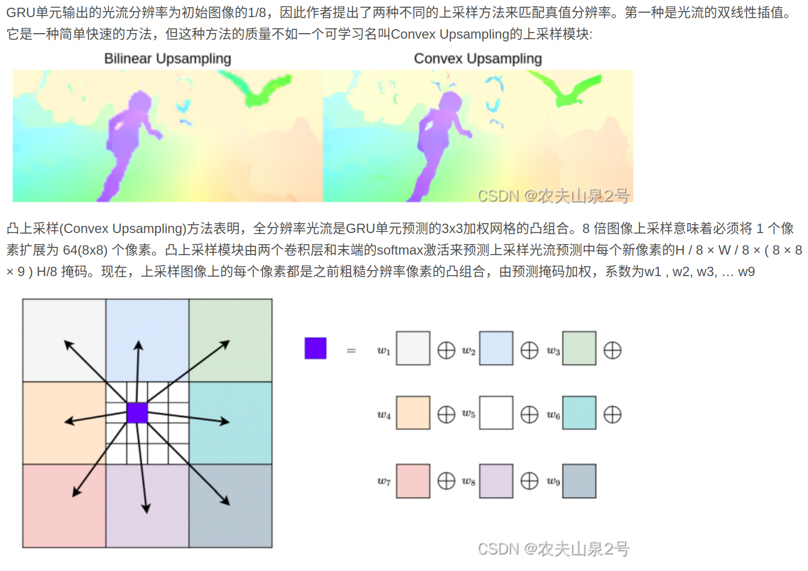

# 1.算法解读

原代码仓库：https://github.com/princeton-vl/RAFT

文章解读：https://zhuanlan.zhihu.com/p/412471557

代码解读：https://blog.csdn.net/qq_39546227/article/details/115005833

各种normalization： https://theaisummer.com/normalization/


模型转onnx：https://blog.csdn.net/weixin_45377629/article/details/12455425224554252

Tensor类型：https://zhuanlan.zhihu.com/p/165152789

GRU网络：https://zhuanlan.zhihu.com/p/32481747

https://www.bilibili.com/video/BV1mf4y157N2



上采样：


# 2.代码运行


```shell
# 1.下载模型
# 链接: https://pan.baidu.com/s/17HVTgVrZHGy9DDTAcihX_A?pwd=trg3 提取码: trg3 
# 2.准备数据
 sudo ln -s /media/zph/Elements/datasets/flyingchairs /home/zph/datasets/flyingchairs
# 3.运行脚本
./train_mixed.sh

```


